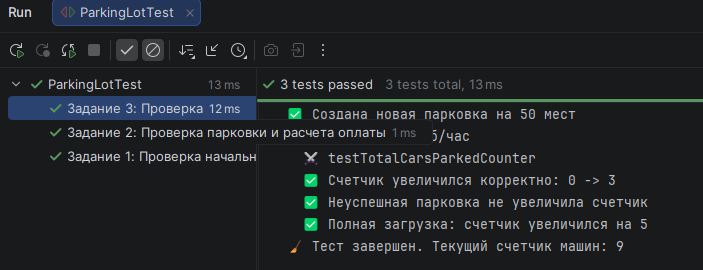
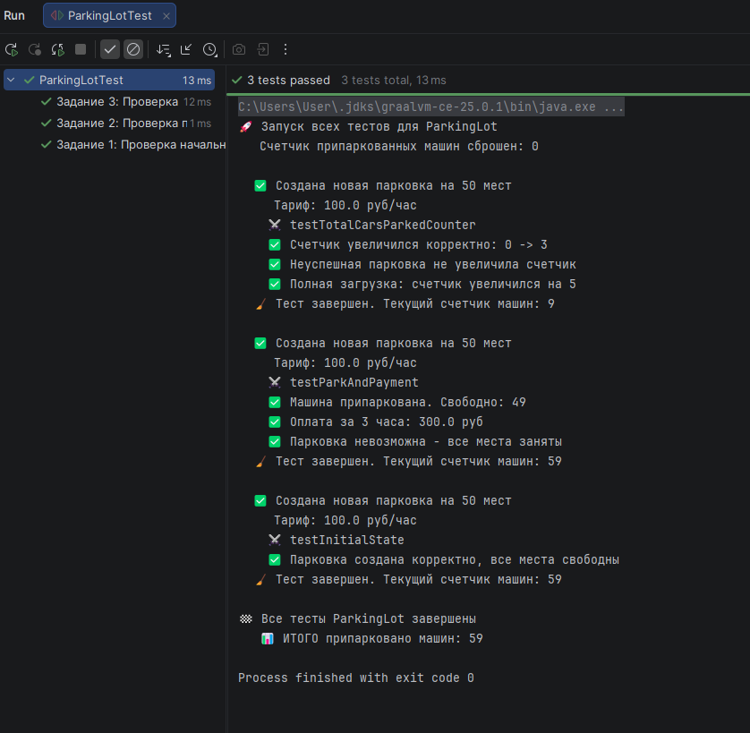
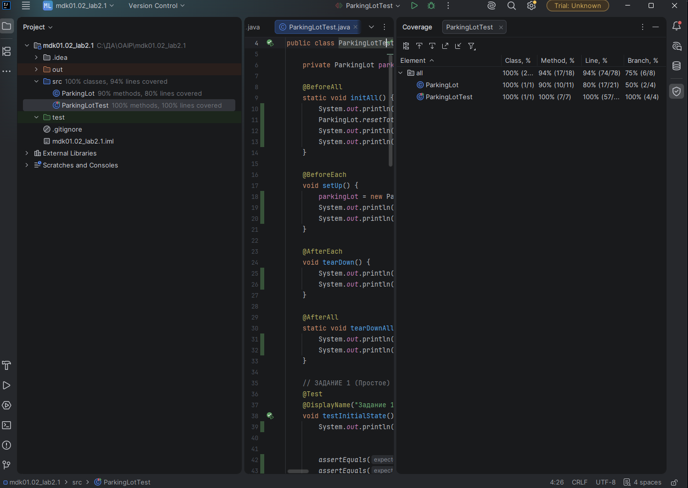

# Лабораторная работа №2_1: Тестовое окружение в JUnit

## 👨‍🎓 Студент
- **ФИО:** Юнусов Ильназ Рустамович
- **Группа:** ИС-247
- **Вариант:** 25 Электронное письмо (EmailMessage)

---

## ✅ Выполненные задания
### Задание 1 (Простое)
**Тест:** Используйте @BeforeEach для создания письма от "ivan@mail.ru" кому "petr@mail.ru". Проверьте, что письмо не отправлено.

### Задание 2 (Среднее)
**Тесты:** Проверьте отправку письма. Напишите два теста с использованием @BeforeEach:
- Отправка заполненного письма (возвращает true, sent становится true).
- Попытка отправить письмо с пустым отправителем (возвращает false).

### Задание 3 (Сложное)
**Тесты:** Введите статический счетчик totalEmailsSent (общее количество отправленных писем). С помощью @BeforeAll инициализируйте счетчик = 0. Каждый успешный вызов send должен увеличивать счетчик на 1. С помощью @AfterEach проверяйте увеличение счетчика. С помощью @AfterAll выведите общее количество отправленных писем.

---

## 📊 Результаты

---

## 📎 Ссылки
- [Код тестов](src/EmailMessageTest.java)
- [Основной класс](src/EmailMessage.java)

*Дата: 24.06.2026*
